# Quick_Guide_To_Root2Shells
## Root Shell
source of inspiration >>[link](https://www.youtube.com/watch?v=01mw0oTHwxg)

---

In this article, we dive into the world of **IoT device hacking**, with a specific focus: **gaining a shell** on a target device. This kind of access can open the door to understanding how the device works internally, uncovering misconfigurations, and learning more about embedded Linux systems.

>[!Warning]
>**This content is for educational purposes only.**  
>The techniques demonstrated are meant to help readers understand how IoT devices can be analyzed, secured, and better designed. **Unauthorized access to systems you do not own or have explicit permission to test is illegal.**
### UART

UART is a protocol used in embedded devices, it transfers data between two pins TX (transmit) and RX (receive). Normally, the pins are on different processors. Data is sent from TX, in a sequence, at a predefined speed. The receiver checks data on RX.

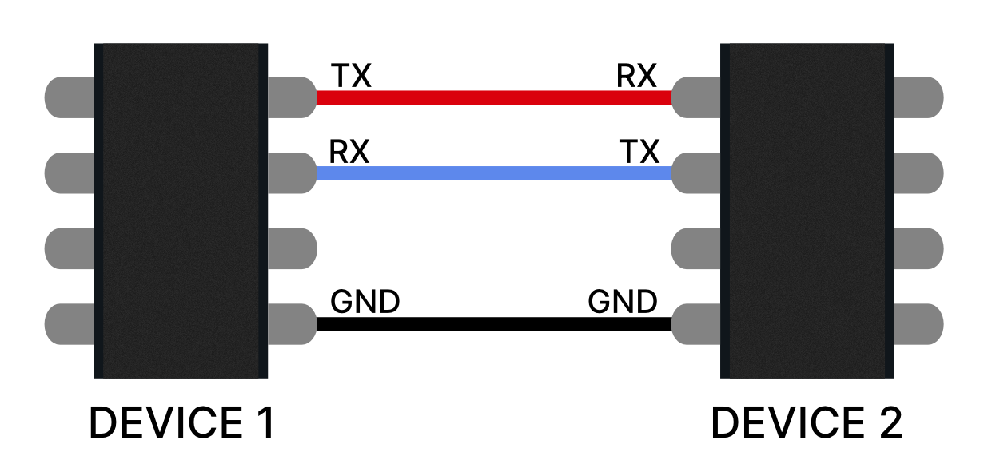
### Finding The UART Interface
#### Examples
UART interface :
`TX`: For transmitting DATA
`RX`: For Receiving DATA
`GND`: Ground
`VCC`: Useless (in our case)

|     | 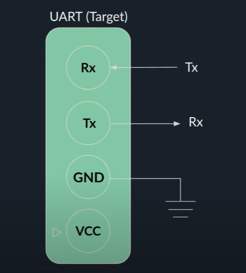 |
| -------- | ------- |

**Easy**: 

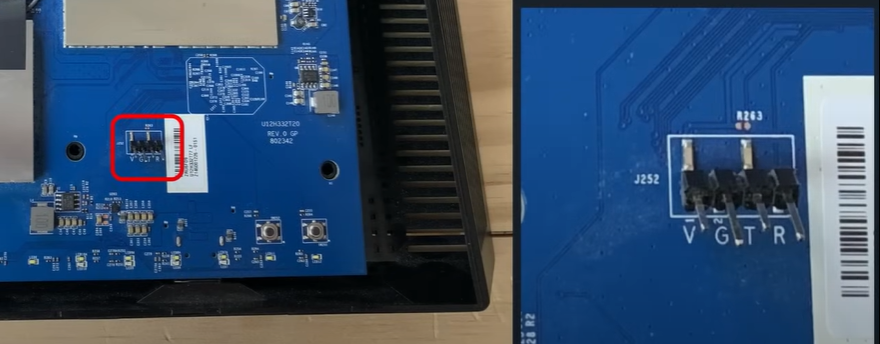

**Medium:**
The connection interface is marked with a triangle:

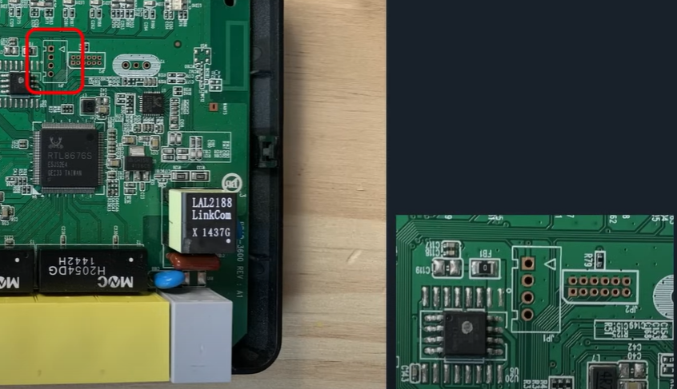

The connection interface is clearly marked:

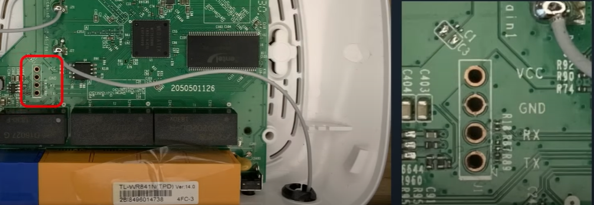

The connection interface not marked and a bit hard to reach:

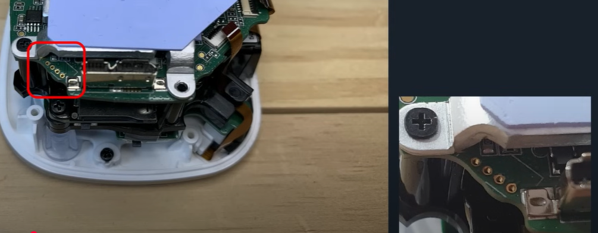

**Hard:**
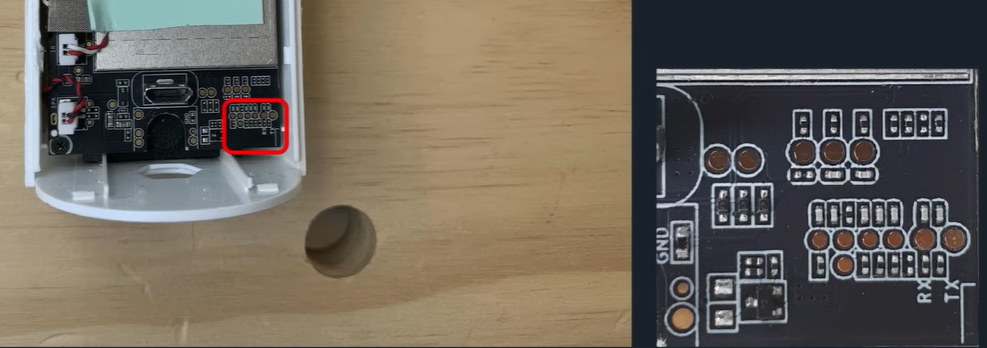

**Extreme:**

GPU hacking, JK, still Hard tho

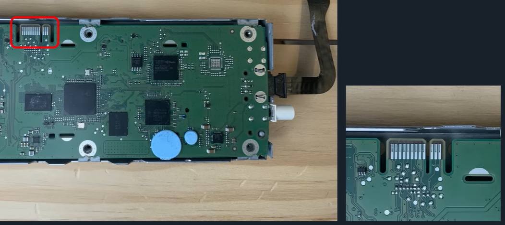

#### Hands-on Stuff
Steps Before Starting
- Set the multi-meter to the continuity mode ⎓  
- Find a grounded element on the device, mostly any metal cover on the board.

**Determining `GND`:**
- DEVICE STATE: Shut **OFF**
- Start testing the pins one by one until a beep sounds comes out of the multi-meter

When the COM is on the metal cover, The V on the 3rd pin hole, A beeping sound occures

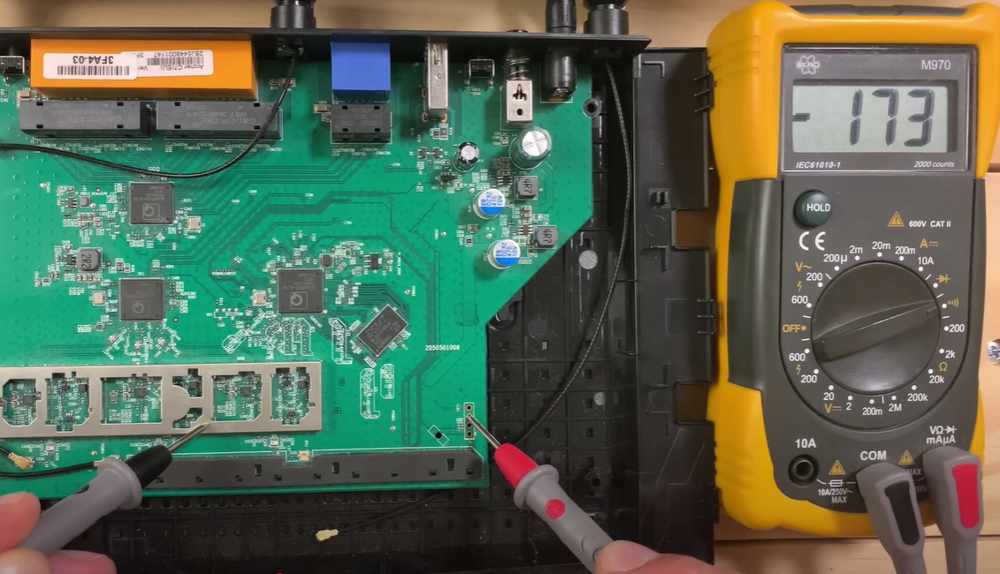

**Determining TX,RX and VCC:**
- DEVICE STATE: Turned **ON**
- Start testing the pins one by one:
	- If the displayed value is = 3.3V -> Thats **VCC**
	- if the displayed value is = 0.0V -> Thats **RX**
	- if the displayed value is > 0.0V -> Thats **TX**

Value on the multi-meter when hitting TX
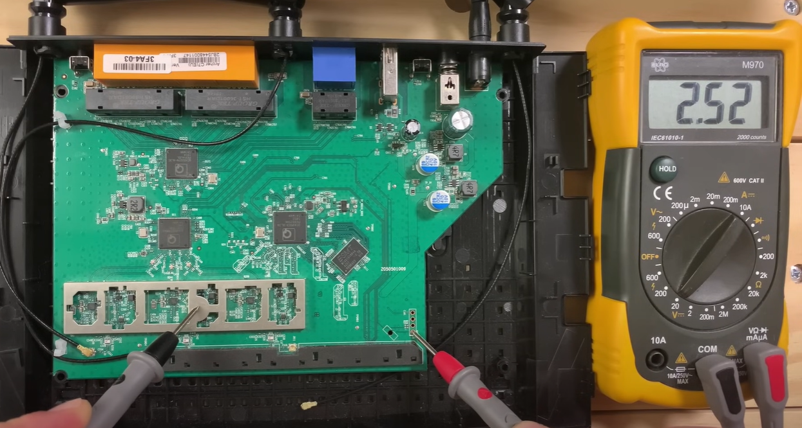

### Connecting the device
| CP2102 | Pins Male Male |
| :-------------------------------------------- | :-------------------------------------------------------- |
| 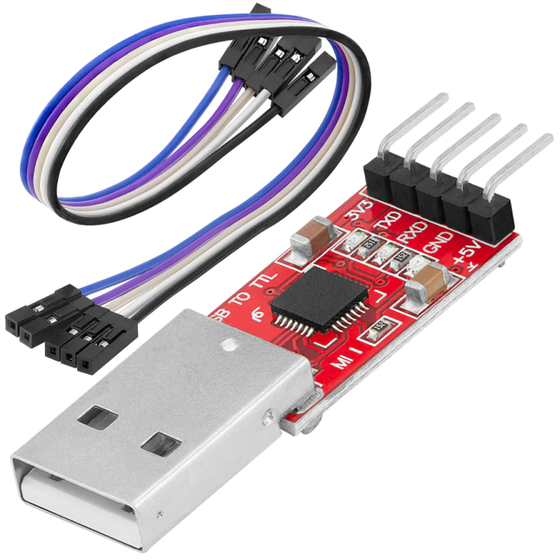 |  |

Using the `CP2102 USB to UART`:
We attach:
- Device's `RX` To CP2102's `TX`
- Device's `TX` to CP2102's `RX`
- Device's `GND` to CP2102's `GND`
- The CP2102 to the computer

Device Manager Interface after connecting the device using CP2102

<b>Green</b> Means its working fine 
<b>Red</b> Means its not identified by the system and probably requires a driver which we can get from [here](https://www.silabs.com/developer-tools/usb-to-uart-bridge-vcp-drivers?tab=downloads)

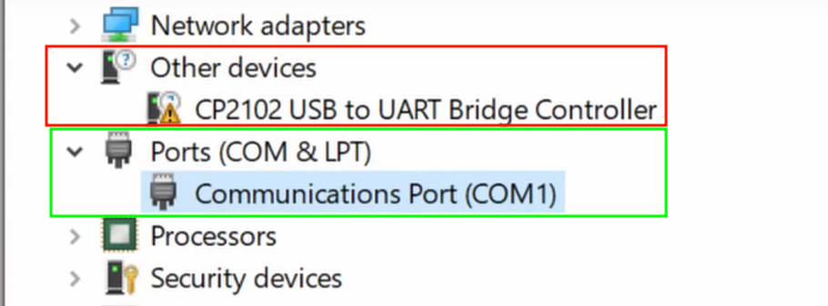

The computer is connected to the device using CP2102 Module

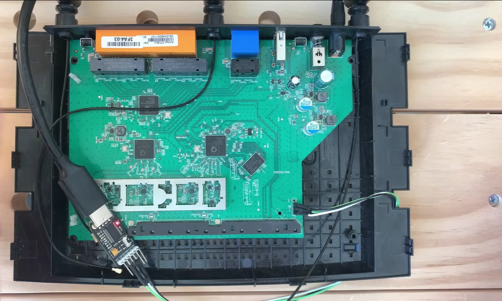

We can setup Putty to connect to the device: 

Green should be set to `serial`, Blue is the COM interface found in Device Manager, Red is the baud rate

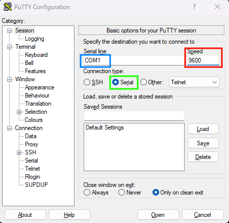

The standard baud rates are the following: 
**4800, 9600, 19200, 38400, 57600, 115200, 230400, 460800, 921600**.

Guessing the baud is easy, but sometimes engineers get creative, so guessing might not be a good option, the logical way is to use a logic analyzer like the `saleae logic 4` but its no longer sold and also ehm..e..expensive, VERY EXPENSIVE (**400$**), after some research I found a good alternative which is the `TZT USB Logic Analyzer 24MHz 8 Channel`, which is 8 channels not only 4, works with the logic analyzer 2 software, and much cheaper (**5\$** max )

TZT USB Logic Analyzer 24MHz 8 Channel

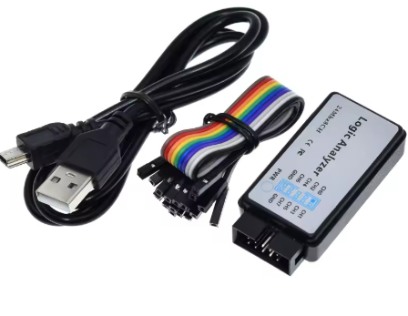

Setting up the analyzer is the same as setting up `CP2102`, we connect it then we open the software:
Connecting the saleae logic 4 to the device

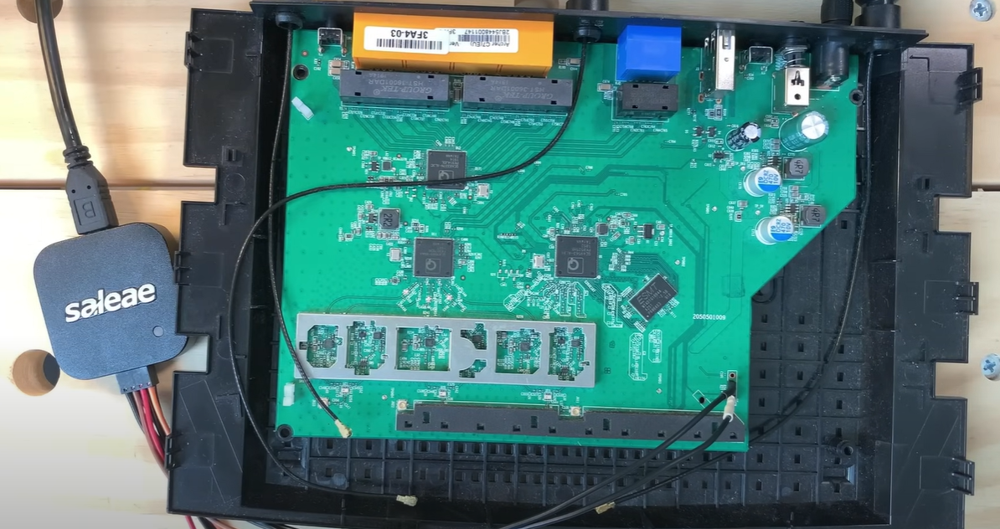

After that we press the start button on the logic analyzer 2 software and then turn on the device:
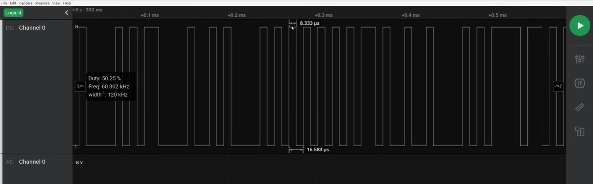
we take the bit duration value (8.333μs = 8333ns) and we divide 1 by it which is 
$1/8333 = 0.000120005 ≃ 115200$ 
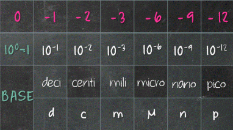

we change that in Putty config and then connect:
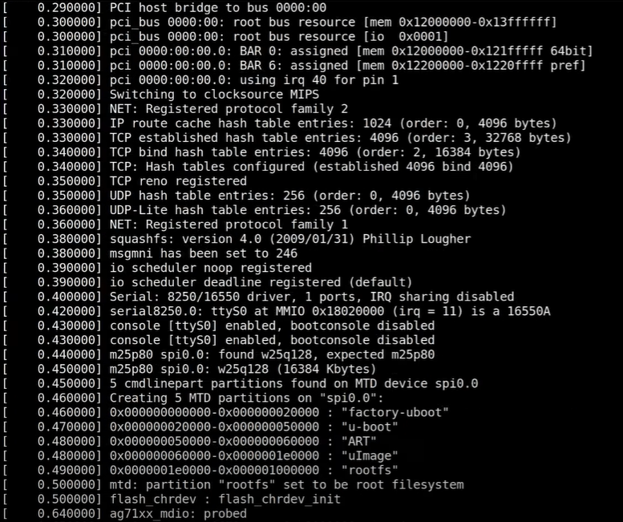
sometimes the connection of `RX` to the cpu might be cut off like this 

| 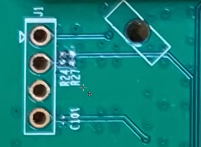 | 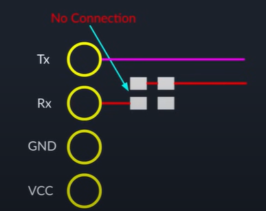 |
|:------------------------------------ |:------------------------------------ |

using paper pin to re-establish the connection between `RX` and the CPU

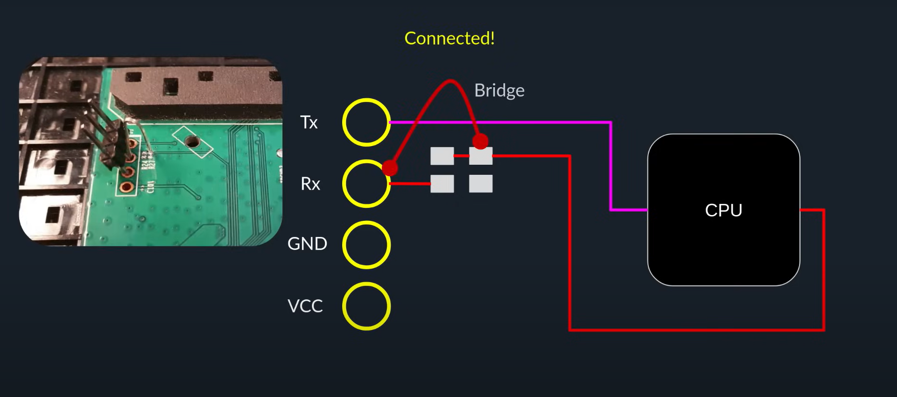

Now after rebooting and connecting hopefully we get a root shell:
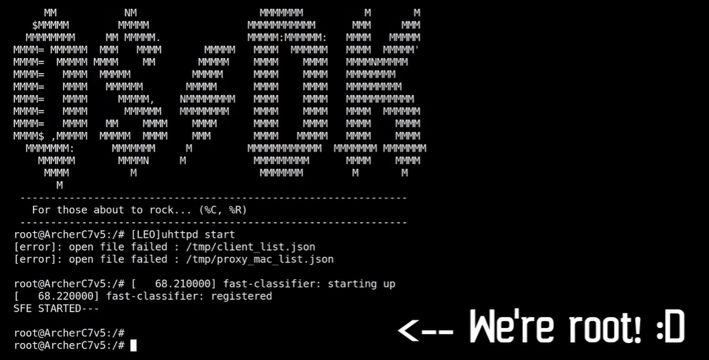

> [!Tip]
> This was a general approach applied on a specific device, you might face different connectors layout or protection mechanisme might come your way, I hope you got something out of this to counter that. Thank you for reading! (why not give us a ⭐) 
#### Toolset 
| Device Name                                | Price (TND)         | Link                                                                                                                                                                   |
| ------------------------------------------ | ------------------- | ---------------------------------------------------------------------------------------------------------------------------------------------------------------------- |
| Analyseur Logic USB 24 M 8 CH              | 35.000              | [link](https://tuni-smart-innovation.com/products/analyseur-logique-usb-24m-8ch?variant=42629345345758)                                                                |
| DT9205A Multimètre Numérique               | 29.000 (was 38.000) | [link](https://tuni-smart-innovation.com/products/dt9205a-multimetre-numerique?_pos=5&_sid=a6e994e89&_ss=r)                                                            |
| Module Convertisseur CP2102 USB → UART TTL | 14.000 (was 17.000) | [link](https://tuni-smart-innovation.com/products/module-convertisseur-cp2102-5pin-usb-vers-uart-ttl?srsltid=AfmBOoqtrKX8orEXKNrZl-NZer1GE3Ar1Ufu81QGgGFdHIjO0gsD9LXZ) |
| Barrette Sécable Double 2.54 mm 40 broches | 1.700               | [link](https://tuni-smart-innovation.com/products/barrette-secable-double-2-54-m-m-40-pines?_pos=34&_sid=e9ee36d10&_ss=r)                                              |

